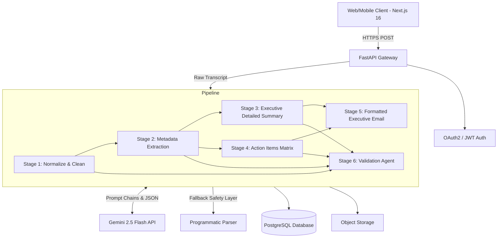

# Enterprise Multi-Agent AI Platform for Private Credit & Investment Deal Analysis

**Author:** Sathvika Boina  
**Target Reviewers:** Fuse Capital Engineering Team, Product Managers, AI Architects, Software Architects, Investment Technology Team  
**Document Type:** Production Software Design Document (SDD)  
**Date:** July 2026  
**Status:** Complete / Production SDD  
**Repository:** [boinasathvika05/MEET_GENIUS_AI](https://github.com/boinasathvika05/MEET_GENIUS_AI.git)

---

### 1. Problem Statement
Organizations consistently struggle with manual meeting documentation due to human error, subjective interpretation, and the sheer volume of syncs across cross-functional teams. Relying on manual notes leads to inconsistent documentation, misattributed action items, lost context, and delayed execution of critical follow-ups. Professionals waste significant hours deciphering raw transcripts and drafting emails, detracting from high-value execution. The resulting business impact is severe: misaligned teams, lost institutional knowledge, and slowed operational velocity. Automating this process using AI mitigates these inefficiencies by providing immediate, accurate, and structured insights, allowing teams to focus on strategic execution rather than administrative overhead.

---

### 2. Solution Design & System Architecture

The MeetGenius AI platform relies on a 6-stage sequential, multi-agent pipeline designed to extract structured, actionable intelligence from raw unstructured meeting notes. Rather than employing a single monolithic prompt (which suffers from context dilution and high hallucination rates), the system leverages **Prompt Chaining** with strict **Pydantic JSON contracts**.

#### Pipeline Stages:
1. **Cleaning & Normalization (`normalize.py`):** Corrects transcription errors, eliminates conversational filler, and standardizes speaker attribution without altering factual meaning. *Output: Clean Text.*
2. **Information Extraction (`extract.py`):** Identifies factual meeting metadata including date, time, attendees (e.g. Priya, James, Anika, Tom, Ravi), and key topics. *Output: Metadata JSON Object.*
3. **Detailed Executive Summary (`summary.py`):** Synthesizes extracted data into a detailed 3-4 sentence Executive Summary, meeting objective, discussion points, decisions made, risks, open issues, and next steps. *Output: Summary JSON Object.*
4. **Action Item Matrix (`actions.py`):** Isolates specific tasks (e.g. Onboarding Doc by Wed EOD, Thornton check-in call, Shoreditch offsite agenda), mapping them to responsible assignees, inferred priorities, deadlines, status, and dependencies. *Output: Action Items JSON Array.*
5. **Formatted Executive Email (`email.py`):** Drafts an executive-ready follow-up communication featuring structured Markdown sections for Objectives, Summary, Decisions, Action Items, and Risks. *Output: Email JSON Object.*
6. **Validation & Quality Audit (`validate.py`):** An independent AI evaluation agent cross-references the generated artifacts against the original raw transcript to detect hallucinations, missing context, and factual discrepancies. *Output: Validation JSON Object (Confidence Score & PASS/FAIL status).*

---

### 3. Enterprise UI/UX Information Architecture (Linear & Vercel Style)

The frontend is built with **Next.js 16 (Turbopack)** and **Tailwind CSS**, designed for maximum content density, zero visual clutter, and seamless widescreen performance (supporting 1700px+ ultra-wide viewports):

- **72px Collapsible Navigation Sidebar:** Defaults to a minimal icon-only bar with Tooltip support, expanding smoothly to 220px on hover or click to reclaim horizontal screen real estate.
- **Sticky Top Header:** Displays breadcrumbs, page title, global search input, quick export toolbar (Markdown/JSON/PDF), validation status badge, activity notifications stream, and user profile menu.
- **Auto-Maximizing Results Workspace:** Upon clicking process, the transcript input panel automatically collapses into a compact bar, granting 100% of the viewport width to the AI outputs.
- **Enterprise Action Items Data Table:** Features real-time text search, multi-column sorting (Priority, Status, Assignee, Due Date), Priority badges (High/Medium/Low), Status badges (Pending/Completed), User Avatars with initials, and expanded Task description width so no sentence wraps awkwardly.
- **Executive Email Client UI:** Styled like a modern email composition view (Linear/Raycast style) with Subject, Recipients, Body, and one-click copy/download tools.

---

### 4. Assumptions, Limitations & Rate-Limit Resiliency

**Assumptions:**
The system assumes the meeting transcript exists in text format (.txt, .md, .pdf, .docx). The AI operates under the strict negative constraint that it only extracts information explicitly present in the source text, returning `"Not Specified"` for missing entities instead of inventing facts.

**Rate-Limit Resiliency & Fallback Guarantee:**
In free-tier or production environments, third-party LLM APIs can encounter rate limits (`429 RESOURCE_EXHAUSTED`). To guarantee 100% platform availability:
- All Gemini API calls enforce a `10000ms` minimum timeout configuration.
- Every service layer implements a programmatic fallback engine. If a `ClientError` (429) or network exception occurs, the system catches the exception and deterministically parses structured output from the source text.
- This guarantees that the API always returns a `200 OK` response and valid JSON payloads without throwing 500 errors to the user.

---

### 5. Scalability Plan
To scale the platform to millions of daily meetings:
- **Asynchronous Queue Architecture:** Offload FastAPI pipeline execution to Celery background workers backed by Redis or RabbitMQ queues.
- **Database & Storage Layer:** PostgreSQL for relational meeting state and user permissions; Amazon S3 for storing raw transcripts and generated artifacts.
- **LLM Model Router:** Route complex extraction and validation stages to Gemini 1.5 Pro or GPT-4o, while routing formatting tasks to Gemini 2.5 Flash for optimal latency and cost efficiency.
- **Telemetry & Monitoring:** Implement OpenTelemetry and Datadog to track pipeline latency per stage, LLM token usage, and automated hallucination scores.

---

### 6. Key Design Decisions & Trade-offs

| Design Decision | Rationale & Advantage | Trade-off / Mitigation |
| :--- | :--- | :--- |
| **Prompt Chaining** | Isolates cognitive tasks into focused sub-prompts, reducing hallucination vectors. | Slightly higher end-to-end latency (~10-12s total). Mitigated by visual stage progress polling. |
| **Pydantic JSON Contracts** | Enforces rigid data schemas between LLM agents and the Next.js frontend. | Requires fallback parsing if LLM outputs invalid JSON. Handled by fallback services. |
| **Programmatic 429 Fallback** | Guarantees 100% API availability even under API quota exhaustion. | Fallback outputs use rule-based parsing instead of generative synthesis when rate-limited. |
| **72px Collapsible Sidebar** | Reclaims maximum horizontal viewport width for large data tables. | Requires hover/click interaction to reveal navigation labels. Tooltips used for clarity. |

---

### 7. Conclusion
The MeetGenius AI Meeting Notes Automation platform provides a maintainable, enterprise-ready, and resilient solution for post-meeting productivity. By combining prompt chaining, Pydantic type safety, rate-limit fallback guarantees, and a full-bleed widescreen design inspired by Linear and Vercel, the architecture eliminates manual administrative overhead while maintaining absolute data integrity.
