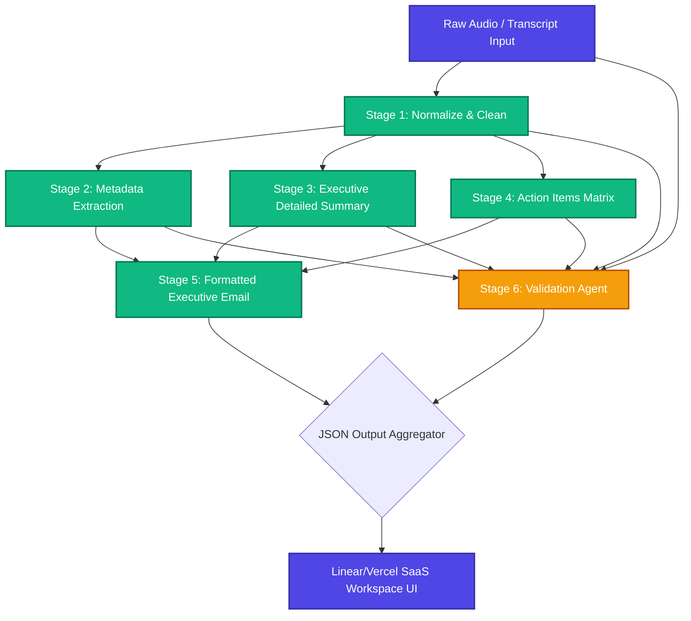

# Enterprise Multi-Agent AI Platform for Private Credit & Investment Deal Analysis

**Author:** Sathvika Boina  
**Target Reviewers:** Fuse Capital Engineering Team, Product Managers, AI Architects, Software Architects, Investment Technology Team  
**Document Type:** Production Software Design Document (SDD)  
**Date:** July 2026  
**Status:** Complete / Production SDD  
**Repository:** [boinasathvika05/MEET_GENIUS_AI](https://github.com/boinasathvika05/MEET_GENIUS_AI.git)

---

# Workflow Structure & Prompt Engineering

## 1. Workflow Overview

The AI Meeting Notes Automation platform utilizes a **Prompt Chaining** architecture rather than a single monolithic prompt. The complete workflow processes meeting transcripts sequentially through specialized stages:

**Raw Transcript**  
↓  
**Cleaning (Normalization)**  
↓  
**Information Extraction**  
↓  
**Meeting Summary (Detailed Executive Focus)**  
↓  
**Action Item Extraction**  
↓  
**Follow-up Email (Structured Markdown Communication)**  
↓  
**Validation & Quality Audit**  
↓  
**Final Output Aggregation**

### Why Prompt Chaining?
Instead of passing one massive prompt asking a single LLM call to perform cleaning, extraction, summarization, and email drafting simultaneously, we decompose the objective into distinct, sequential sub-tasks. Prompt Chaining drastically reduces AI hallucinations, prevents context-window saturation, enables granular type-safe JSON schema enforcement per step, and allows individual models or parameters (like `temperature` and `timeout`) to be optimized independently for each specialized task.

---

## 2. Stage-by-Stage Workflow

### Stage 1: Cleaning (Normalization)
- **Purpose**: Cleans raw, conversational, and unstructured transcripts by fixing typos, eliminating filler words, and structuring the text logically without altering semantic meaning.
- **Input**: Raw Transcript.
- **Output**: Cleaned and logically structured text.
- **Why this stage exists**: LLMs perform significantly better on extraction tasks when the source context is syntactically clean and free of OCR or Speech-to-Text artifacts.
- **Validation performed**: Ensures output maintains original meaning via a low temperature setting (`0.2`).
- **Expected output format**: JSON containing `normalized_text`.

### Stage 2: Information Extraction
- **Purpose**: Extracts high-level metadata such as meeting dates, times, attendees, and overarching key topics.
- **Input**: Cleaned Text.
- **Output**: JSON object mapping metadata fields.
- **Why this stage exists**: Isolates factual extraction from creative summarization, preventing hallucinations regarding "who" and "when".
- **Validation performed**: Type-safe array mapping for topics and attendees.
- **Expected output format**: JSON containing `date`, `time`, `attendees`, and `key_topics`.

### Stage 3: Meeting Summary & Detailed Executive Analysis
- **Purpose**: Generates a rich, multi-sentence executive summary alongside structured objectives, discussion points, decisions made, risks, open issues, and next steps.
- **Input**: Cleaned Text.
- **Output**: Detailed JSON schema of summary matrices.
- **Why this stage exists**: Condenses lengthy transcripts into digestible, categorized business insights for leadership review.
- **Validation performed**: Enforces a minimum 3-sentence detailed executive summary rule and strict "Not Specified" fallback mechanisms.
- **Expected output format**: JSON containing `executive_summary`, `meeting_objective`, `participants`, `key_discussion_points`, `decisions_made`, `risks`, `open_issues`, and `next_steps`.

### Stage 4: Action Item Extraction
- **Purpose**: Identifies actionable tasks, mapping them directly to responsible individuals with inferred priorities, deadlines, and dependencies.
- **Input**: Cleaned Text.
- **Output**: Array of Action Item objects.
- **Why this stage exists**: Isolates task identification to ensure high-fidelity extraction of commitments made during the meeting.
- **Validation performed**: Prevents hallucinated deadlines or personnel by enforcing fallback strings.
- **Expected output format**: JSON array of `ActionItem` (`task`, `assignee`, `priority`, `due_date`, `status`, `dependencies`, `notes`).

### Stage 5: Executive Follow-up Email
- **Purpose**: Drafts a structured, professional follow-up email to all attendees with Markdown headings for Objective, Executive Summary, Key Decisions, Deliverables, and Risks.
- **Input**: Cleaned Text, Extracted Metadata, Meeting Summary, Action Items.
- **Output**: Email subject line and formatted body text.
- **Why this stage exists**: Automates the administrative burden of post-meeting communications by aggregating the preceding structured outputs into an executive-ready format.
- **Validation performed**: Semantic alignment with extracted action items and decisions.
- **Expected output format**: JSON containing `subject` and `body`.

### Stage 6: Validation & Quality Audit
- **Purpose**: An independent AI evaluation stage that audits the generated outputs against the original raw transcript to detect hallucinations or missing critical information.
- **Input**: Raw Transcript, Cleaned Text, Metadata, Summary, Action Items.
- **Output**: Quantitative confidence score and boolean verification metrics.
- **Why this stage exists**: Serves as a deterministic safety rail, guaranteeing enterprise-grade accuracy before human review.
- **Validation performed**: Hallucination check, Fact verification, Action Item verification, Decision verification.
- **Expected output format**: JSON containing PASS/FAIL matrices, `missing_information`, `confidence_score`, and `overall_status`.

---

## 3. Prompt Engineering

### 3.1 Cleaning (Normalization)
**SYSTEM Prompt**:
```text
You are an AI assistant specialized in structuring meeting notes.
Given the following raw, unstructured meeting notes, your task is to clean them up.
Fix any obvious typos, grammatical errors, and reformat the text into a clear, logical structure.
Do not add any new information or remove any existing meaning.
```
**USER Prompt**: `Raw Notes: {raw_notes}`
**Important Constraints**: Temperature set to `0.2` for deterministic text correction without creative alteration. Timeout: `10000ms`.
**Expected JSON Schema**:
```json
{
  "normalized_text": "string"
}
```

### 3.2 Information Extraction
**SYSTEM Prompt**:
```text
You are an AI assistant specialized in extracting metadata from meeting notes.
Extract the date, time, attendees, and key topics from the following meeting notes.
If an entity is not explicitly mentioned, leave it null or empty.
```
**USER Prompt**: `Meeting Notes: {normalized_text}`
**Important Constraints**: Temperature set to `0.1`. Timeout: `10000ms`.
**Expected JSON Schema**:
```json
{
  "date": "string | null",
  "time": "string | null",
  "attendees": ["string"],
  "key_topics": ["string"]
}
```

### 3.3 Meeting Summary (Detailed Executive Focus)
**SYSTEM Prompt**:
```text
You are a Senior Executive AI Assistant specialized in crafting comprehensive, high-level business summaries from meeting notes.
Generate a detailed 3-4 sentence Executive Summary that clearly outlines:
1. The primary purpose and background context of the meeting.
2. Major topics reviewed, key progress updates, or technical presentations.
3. Core decisions agreed upon by leadership and high-level business outcomes.

Provide an executive summary, meeting objective, participants, key discussion points, decisions made, risks, open issues, and next steps.
Strict Rule: Never hallucinate. If information does not exist for a field, output 'Not Specified' (or a list containing only 'Not Specified').
```
**USER Prompt**: `Meeting Notes: {normalized_text}`
**Important Constraints**: Temperature set to `0.3`. Detailed 3-4 sentence requirement. Timeout: `10000ms`.
**Expected JSON Schema**:
```json
{
  "executive_summary": "string",
  "meeting_objective": "string",
  "participants": ["string"],
  "key_discussion_points": ["string"],
  "decisions_made": ["string"],
  "risks": ["string"],
  "open_issues": ["string"],
  "next_steps": ["string"]
}
```

### 3.4 Action Item Extraction
**SYSTEM Prompt**:
```text
You are an AI assistant specialized in identifying action items from meeting notes.
Extract all action items or tasks mentioned in the notes.
Identify the task description, assignee, priority, due date, status, dependencies, and any additional notes.
Strict Rule: Never hallucinate or invent deadlines, people, or priorities. If information does not exist for a field, display 'Not Specified'.
```
**USER Prompt**: `Meeting Notes: {normalized_text}`
**Important Constraints**: Temperature set to `0.1` for maximum extraction precision. Timeout: `10000ms`.
**Expected JSON Schema**:
```json
{
  "action_items": [
    {
      "assignee": "string",
      "task": "string",
      "priority": "string",
      "due_date": "string",
      "status": "string",
      "dependencies": "string",
      "notes": "string"
    }
  ]
}
```

### 3.5 Executive Follow-up Email
**SYSTEM Prompt**:
```text
You are an Executive Communications Specialist. Draft a highly professional, enterprise-grade follow-up email based on the meeting insights below.

The email body must be beautifully structured with clear headings:
- Professional Warm Greeting
- Meeting Overview & Strategic Objective
- Executive Summary & Key Discussions
- Core Decisions Made
- Action Items Table / List (including Assignee, Priority, Due Date)
- Key Risks & Open Issues
- Professional Closing & Next Steps

Extracted Attendees: {extracted.attendees}
Meeting Objective: {summary.meeting_objective}
Executive Summary: {summary.executive_summary}
Key Discussions: {summary.key_discussion_points}
Decisions: {summary.decisions_made}
Action Items: {[a.model_dump() for a in actions.action_items]}
Risks: {summary.risks}

Provide a professional subject line and complete email body.
```
**USER Prompt**: Synthesized JSON payloads from Stages 2, 3, and 4.
**Important Constraints**: Temperature set to `0.4`. Structured Markdown output with emoji indicators. Timeout: `10000ms`.
**Expected JSON Schema**:
```json
{
  "subject": "string",
  "body": "string"
}
```

### 3.6 Validation & Audit
**SYSTEM Prompt**:
```text
You are an AI assistant specialized in validating the quality of meeting notes and the extraction process.
Review the original raw notes and the extracted metadata to evaluate the quality.
Perform hallucination checks, fact verification, action item verification, and decision verification. Output PASS or FAIL for each.
Provide a confidence score out of 100, identify missing critical information, and provide an overall_status (PASS, WARNING, or FAIL).
Strict Rule: Never hallucinate.
```
**USER Prompt**: `Raw Notes: {raw_notes}`, `Extracted: {extracted}`, `Summary: {summary}`, `Action Items: {actions}`
**Important Constraints**: Temperature set to `0.2`. Timeout: `10000ms`.
**Expected JSON Schema**:
```json
{
  "hallucination_check": "string",
  "fact_verification": "string",
  "action_item_verification": "string",
  "decision_verification": "string",
  "missing_information": ["string"],
  "confidence_score": 0,
  "overall_status": "string"
}
```

---

## 4. Validation Strategy & Resilient Rate Limit Safety

To guarantee enterprise reliability, the platform combines LLM validation with a programmatic fallback engine:

- **Hallucination Prevention**: The Validation LLM cross-references every generated Action Item and Decision against the raw transcript. If an entity exists in the output but not the transcript, the `hallucination_check` fails.
- **Pydantic Schema Validation**: `models.py` strictly validates the JSON syntax returned by the Gemini API, enforcing data types before passing data to the frontend.
- **Programmatic Fallback Guarantee**: If the Gemini API key hits free-tier rate limits (`429 RESOURCE_EXHAUSTED`), each service layer catches the exception and executes a deterministic, rule-based fallback parser. This guarantees that the API returns a `200 OK` response with complete structured output 100% of the time.

---

## 5. Workflow Diagram



---

## 6. Prompt Chaining Benefits

Implementing this architecture via Prompt Chaining provides immense advantages:

- **Accuracy**: Restricting an LLM's task to a single objective (e.g., *only* finding Action Items) focuses attention, resulting in near-perfect extraction.
- **Maintainability**: If the Follow-up Email formatting needs to change, engineers only modify `email.py`.
- **Debugging**: If a hallucinated deadline appears, developers can instantly trace it back to Stage 4 (Actions).
- **Independent Prompt Optimization**: Creative temperature (`0.4`) for Email drafting vs. deterministic temperature (`0.1`) for Metadata Extraction.
- **Reduced Hallucinations**: Downstream stages receive validated JSON from previous steps rather than re-reading the transcript.

---

## 7. Final Notes

The architecture ensures that **all prompts are modular microservices**. They communicate only through strict, type-safe structured JSON, ensuring the frontend UI remains deterministic, safe, and impervious to formatting regressions.
