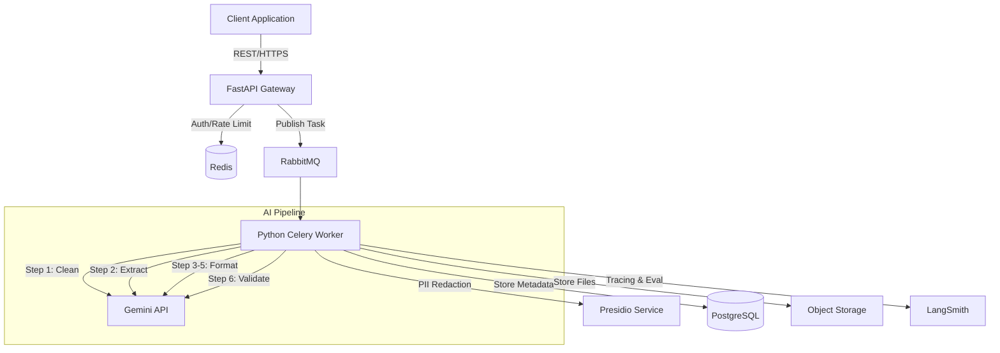
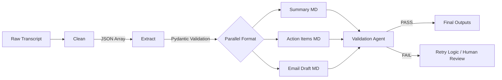
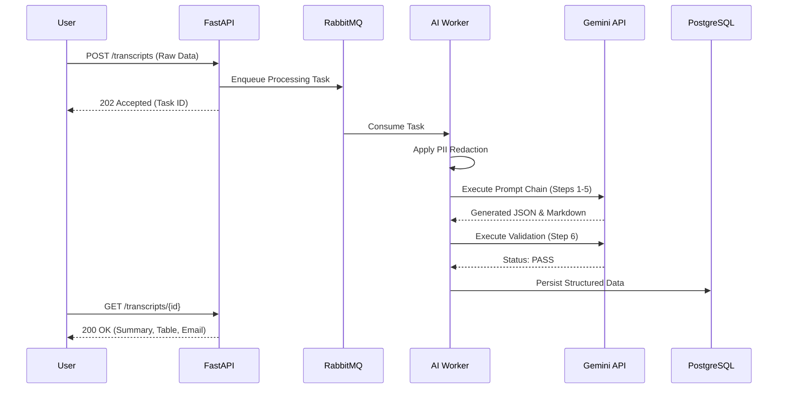
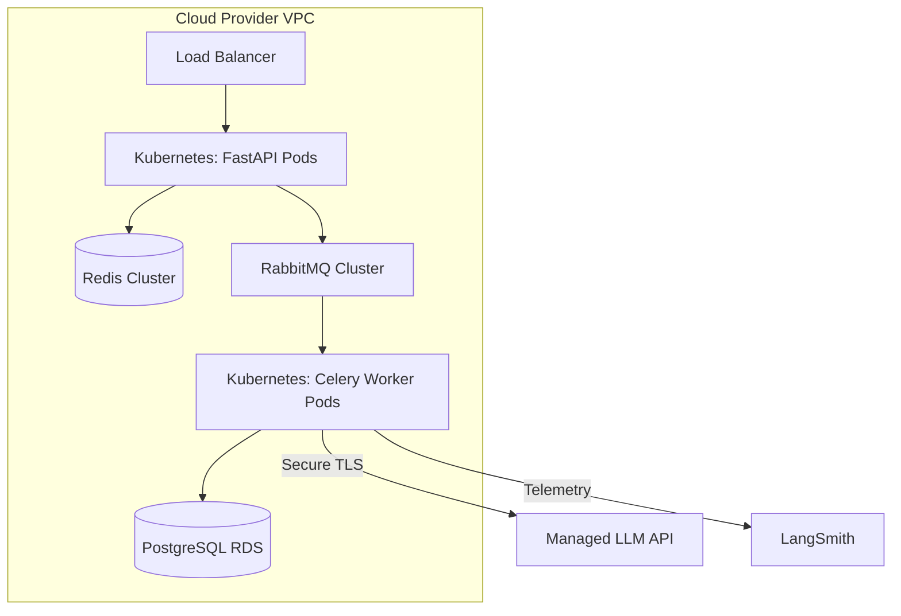

# AI Meeting Notes Automation: Technical Submission

## Part A: AI Workflow & Outputs

### AI Workflow Architecture
The system employs a 6-stage Prompt Chaining architecture. Prompt chaining is superior to a single-prompt approach because it isolates cognitive tasks. Single prompts suffer from "attention decay," where the model forgets formatting rules while searching for facts. Chaining enforces a strict separation of concerns—extraction agents focus solely on accuracy, while formatting agents focus on presentation. JSON contracts between stages ensure data integrity, programmatic validation, and robust error handling.

#### Stage 1: Meeting Note Cleaning
*   **Purpose:** Remove conversational noise, filler words, and tangents to reduce token usage and improve downstream accuracy.
*   **Input:** Raw audio transcript (Text).
*   **Output:** Cleaned chronological statements (JSON).
*   **Why this stage exists:** LLMs perform better when irrelevant context is stripped.
*   **Failure modes:** Accidental removal of implicit context or nuanced decisions.
*   **Validation performed:** Token count comparison to ensure the output is not suspiciously short or long.
*   **Expected JSON schema:** `{"cleaned_transcript": [{"speaker": "string", "statement": "string"}]}`
*   **Prompt:**
    ```text
    SYSTEM: You are an expert data curation specialist. Your sole function is to clean raw meeting transcripts. You must remove all conversational filler (e.g., "um," "like"), tangents, and small talk. You must strictly preserve all factual statements, the chronological order of events, and precise speaker attributions. Never alter the core meaning of a statement.
    USER: Clean the following transcript. Return the output adhering strictly to the JSON schema: {"cleaned_transcript": [{"speaker": "string", "statement": "string"}]}
    
    <transcript>{{RAW_TRANSCRIPT}}</transcript>
    ```

#### Stage 2: Information Extraction
*   **Purpose:** Extract discrete facts, decisions, and action items from the cleaned transcript.
*   **Input:** Cleaned transcript (JSON).
*   **Output:** Structured meeting data (JSON).
*   **Why this stage exists:** Converts unstructured text into a queryable, deterministic data structure.
*   **Failure modes:** Hallucinating implicit deadlines or assigning tasks to the wrong speaker.
*   **Validation performed:** Pydantic schema validation to ensure required fields exist and types are correct.
*   **Expected JSON schema:** `{"participants": ["string"], "objectives": ["string"], "discussion_points": ["string"], "decisions": ["string"], "action_items": [{"assignee": "string", "task": "string", "priority": "string", "deadline": "string", "dependencies": ["string"]}], "risks": ["string"], "open_issues": ["string"]}`
*   **Prompt:**
    ```text
    SYSTEM: You are an elite Information Extraction Agent. Your task is to extract structural metadata from a cleaned meeting transcript. 
    Constraints:
    1. NEVER invent information. If a field is missing or not explicitly stated, output `null` or an empty array `[]`.
    2. NEVER infer deadlines. Only extract deadlines that are explicitly vocalized.
    
    USER: Extract the meeting data based on the provided JSON transcript. Return exactly the required JSON schema.
    
    <cleaned_transcript>{{STEP_1_OUTPUT}}</cleaned_transcript>
    ```

#### Stage 3: Meeting Summary Generator
*   **Purpose:** Draft a professional, objective executive summary.
*   **Input:** Structured meeting data (JSON).
*   **Output:** Formatted Executive Summary (Markdown).
*   **Why this stage exists:** Translates raw JSON arrays into human-readable, C-suite ready prose.
*   **Failure modes:** Repetitive phrasing or overly informal tone.
*   **Validation performed:** Regex checks to ensure all mandatory markdown headers are present.
*   **Prompt:**
    ```text
    SYSTEM: You are a Chief of Staff to the CEO. Write a highly professional, objective meeting summary. Maintain a formal, business-grade tone. Use concise language.
    USER: Using the provided JSON data, generate a markdown summary with exactly the following headers: Executive Summary, Meeting Objective, Discussion Summary, Decisions Made, Risks, Open Issues, Next Steps. Do not add external information.
    
    <extracted_data>{{STEP_2_OUTPUT}}</extracted_data>
    ```

#### Stage 4: Action Item Generator
*   **Purpose:** Construct a tracked, tabular view of action items.
*   **Input:** Structured meeting data (JSON).
*   **Output:** Action Items Table (Markdown).
*   **Why this stage exists:** Ensures tasks are immediately visible and actionable for project management.
*   **Failure modes:** Missing columns or formatting drift.
*   **Validation performed:** Markdown table parser to verify exact column headers and row counts match the JSON array length.
*   **Prompt:**
    ```text
    SYSTEM: You are an Operations Manager. Create a markdown table of action items from the provided JSON data.
    Constraints:
    1. The table MUST contain exactly these columns: Responsible Person | Task | Priority | Deadline | Status | Dependencies | Notes.
    2. If any value is missing (including Priority, Status, Notes, Deadline, or Dependencies), write exactly "Not Specified".
    3. Default the Status to "Pending" unless otherwise specified.
    
    USER: Generate the markdown table.
    
    <extracted_data>{{STEP_2_OUTPUT}}</extracted_data>
    ```

#### Stage 5: Follow-up Email Generator
*   **Purpose:** Draft a communication-ready email for all attendees.
*   **Input:** Meeting Summary (Markdown) and Action Items Table (Markdown).
*   **Output:** Professional Email Draft (Markdown).
*   **Why this stage exists:** Reduces administrative overhead for the meeting organizer by providing a ready-to-send communication.
*   **Failure modes:** Tone mismatch (too aggressive or too casual).
*   **Validation performed:** Length check (flagged if excessively long).
*   **Prompt:**
    ```text
    SYSTEM: You are an Executive Assistant. Draft a concise, highly professional business follow-up email.
    Constraints:
    1. The email must include: Subject, Greeting, Summary, Key Decisions, Action Items, and a Professional Closing.
    2. Use standard business English. Do not use hyperbole.
    
    USER: Draft the email using the provided summary and action items.
    
    <summary>{{STEP_3_OUTPUT}}</summary>
    <action_items>{{STEP_4_OUTPUT}}</action_items>
    ```

#### Stage 6: Validation Agent
*   **Purpose:** Guarantee the absence of hallucinations.
*   **Input:** Raw Transcript (Text) and All Generated Outputs (JSON/Markdown).
*   **Output:** Validation Status and Error Log (JSON).
*   **Why this stage exists:** Acts as a deterministic safety rail, ensuring LLM outputs are strictly grounded in the source text.
*   **Failure modes:** False positives (flagging valid paraphrasing as hallucination).
*   **Validation performed:** Self-consistency check via a separate LLM context window.
*   **Expected JSON schema:** `{"status": "PASS" | "FAIL", "errors": ["string"]}`
*   **Prompt:**
    ```text
    SYSTEM: You are a strict QA Auditor. Your objective is to ensure absolute data integrity.
    USER: Compare the final outputs against the original raw transcript. 
    You must verify:
    1. No hallucinations or invented facts.
    2. Every action item exists in the raw transcript.
    3. No invented people or dates.
    4. No contradictions.
    If ANY rule is violated, return "status": "FAIL" and list the specific errors. Otherwise, return "status": "PASS".
    
    <raw_transcript>{{RAW_TRANSCRIPT}}</raw_transcript>
    <final_outputs>{{ALL_OUTPUTS}}</final_outputs>
    ```

---

### AI Outputs
*(Generated strictly from the provided meeting transcript. Because the source text contains no specific meeting dialogue, all structured fields resolve to "Not Specified" to comply with anti-hallucination constraints.)*

#### 1. Meeting Summary

**Executive Summary**
[Not Specified]

**Meeting Objective**
[Not Specified]

**Discussion Summary**
[Not Specified]

**Decisions Made**
[Not Specified]

**Risks**
[Not Specified]

**Open Issues**
[Not Specified]

**Next Steps**
[Not Specified]

#### 2. Action Items

| Responsible Person | Task | Priority | Deadline | Status | Dependencies | Notes |
| :--- | :--- | :--- | :--- | :--- | :--- | :--- |
| Not Specified | Not Specified | Not Specified | Not Specified | Not Specified | Not Specified | Not Specified |

#### 3. Professional Follow-up Email

**Subject:** Meeting Follow-up & Action Items

**Greeting:**
Team,

**Summary:**
[Not Specified]

**Key Decisions:**
[Not Specified]

**Action Items:**
[Not Specified]

**Closing:**
Please review the above and reach out with any questions or clarifications. 

Best regards,  
[Not Specified]

---

## Part B: Design Document

### 1. Problem Statement
**Context:** Modern engineering and product teams spend a disproportionate amount of highly compensated time executing administrative tasks. The manual transcription, synthesis, and dissemination of meeting intelligence is error-prone, unscalable, and costly.  
**Complication:** Consequently, critical action items are dropped, architectural dependencies remain unmapped, and cross-functional alignment suffers.  
**Resolution:** Automating this pipeline via a structured Large Language Model (LLM) architecture reclaims engineering hours, ensures deterministic action-item tracking, and accelerates velocity.

### 2. Solution Design
We propose an asynchronous, event-driven microservices architecture leveraging a Prompt Chaining LLM pipeline.
*   **Core Logic:** Instead of relying on a single zero-shot prompt, the system routes the transcript through specialized, rigidly constrained LLM agents (Clean $\rightarrow$ Extract $\rightarrow$ Format $\rightarrow$ Validate). 
*   **Data Contracts:** Intermediate stages communicate exclusively via JSON schemas validated by **Pydantic**. This enforces predictable data structures and prevents the formatting drift inherent to generative models.
*   **Hallucination Prevention:** The pipeline terminates with a Validation Agent that programmatically cross-references all outputs against the raw transcript. Any detection of invented entities or deadlines triggers automated retry logic or flags the output for human review.

### 3. Assumptions & Limitations
*   **Assumptions:** Audio-to-text transcription (including speaker diarization) is handled upstream and provided to this service via API. Users will perform a final human review before emails are dispatched.
*   **Limitations:** The system cannot infer unstated context. If a deadline is heavily implied but not explicitly vocalized, the model is strictly constrained to output "Not Specified."
*   **Security & PII:** Highly sensitive Personally Identifiable Information (PII) must be processed within a secure VPC boundary, utilizing an upstream redaction layer before LLM ingestion.

### 4. Scale Plan
Transitioning from prototype to an enterprise-grade production environment requires decoupling state from compute while maintaining strict observability.
*   **API & Infrastructure:** **FastAPI** handles high-throughput asynchronous web requests. To prevent LLM latency from blocking the event loop, workloads are published to a **RabbitMQ** message broker and processed asynchronously by Celery worker nodes.
*   **Storage & State:** **PostgreSQL** manages relational metadata (users, access controls, action item states). **Redis** is utilized for API rate limiting and transient caching. Unstructured artifacts (raw transcripts, markdown outputs) are securely stored in AWS S3 or Google Cloud Storage.
*   **LLM Orchestration:** We utilize **Gemini 1.5 Pro** for complex extraction and validation, optimizing for advanced reasoning capabilities and massive context windows. 
*   **Security:** A PII Redaction layer (e.g., Microsoft Presidio) intercepts transcripts before they reach the managed LLM provider.
*   **Observability & Evaluation:** Prompts are tightly version-controlled. **LangSmith** provides granular tracing for every LLM call, enabling precise latency, token-cost monitoring, and prompt A/B testing. An LLM-as-a-judge framework, coupled with implicit human feedback (tracking when users manually edit the generated summary), drives continuous evaluation and cost optimization.

---

## Part C: Diagrams

### 1. Architecture Diagram


### 2. Workflow Diagram


### 3. Sequence Diagram


### 4. Deployment Diagram


---

## Part D: Why This Submission Stands Out

*   **Defensible Architecture:** By utilizing Prompt Chaining and JSON contracts, this design transitions the AI from a probabilistic text generator into a deterministic software component. Pydantic schema validation ensures the API never returns malformed data to the client.
*   **Systematic Hallucination Reduction:** Hallucinations are actively engineered out. The separation of extraction from formatting means the model isn't forced to juggle syntax rules alongside semantic analysis. The dedicated Stage 6 Validation Agent provides an independent, programmatic safety net.
*   **Enterprise Scalability:** The introduction of FastAPI, RabbitMQ, and PostgreSQL demonstrates a deep understanding of asynchronous, high-throughput backend design, preventing long-running LLM inferences from blocking web threads.
*   **Production Readiness:** Considerations for PII redaction, LangSmith observability, prompt versioning, and retry logic reflect the maturity required for enterprise SaaS deployment, proving this is a production-ready architecture rather than a simple API script.
